# [1]{style="color:#d496d4; background:none;"} Overview {#overview}

Still in the same storyline with the previous [Take Home Exercise 2](https://isss608-vriadi.netlify.app/take-home_ex/take-home_ex02/take-home_ex02), Clepper Jessen, an investigative journalist, is uncovering possible corruption in Oceanus linked to the closure of Nemo Reef and the arrival of pop star Sailor Shift. Using intercepted radio communications, a knowledge graph was created to map out interactions between people, vessels, and organizations. This Mini Challenge aims to support Clepper's investigation through data-driven visual analytics, uncovering patterns, pseudonym usage, social groupings, and suspicious behavior—especially concerning Nadia Conti, a previously implicated figure in illegal fishing.

# [2]{style="color:#d496d4; background:none;"} Objective {#objective}

To support this investigation, a series of three Shiny applications under the ReefWhispers project will be developed to transform this data into actionable insights through visual analytics. Details will be covered in [Chapter 3: Storyboard](#storyboard) and [Chapter 4: UI Design](#uidesign).

This take home exercise 3 objective is to:

-   Evaluate and determine the necessary R packages needed for your Shiny application are supported in R CRAN
-   Prepare and test the specific R codes can be run and return the correct output as expected
-   Determine the parameters and outputs that will be exposed on the Shiny applications, and
-   Select the appropriate Shiny UI components for exposing the parameters determine above.

# [3]{style="color:#d496d4; background:none;"} Storyboard {#storyboard}

**The first app**, [Temporal Pattern and Communication Network](#app1), focuses on visual exploration of the intercepted communication metadata. The app will be divided into 4 main section that will be further detailed in [Chapter 4](#app1). It will be focusing on:

-   Identifying temporal patterns in communications.

-   Revealing relationships and influence among entities (people, vessels, groups).

**The second app**, [Relationship Clusters and Pseudonyms](#app2), will be based on Part 2 - Relationship Cluster and Pseudonym: [Hoa's Take Home Exercise 2](https://isss608-ay2024-25t.netlify.app/take-home_ex/take-home_ex02/take-home_ex02). It aims to deepen the analysis of communication networks by identifying patterns of association and hidden identities through an interactive platform for revealing the structure and semantics behind the communication web, and will be further detailed in [Chapter 4](#app2). It will be focusing on:

-   Uncovering interactions and relationships between vessels and individuals in the network.

-   Identifying tightly knit groups and inferring the dominant topics of their discussions.

-   Detecting the use of pseudonyms and linking them back to real identities.

-   Exploring how visual analytics can help expose common identities disguised under multiple aliases.

**The third app**, [Time Series Analysis and Social Network Graph](#app3), will be based on Part 3 - Time Series Analysis and Social Network graph: [Summer's Take Home Exercise 2](https://summernguyenn.netlify.app/take-home_ex/take-home_ex02/take-home_ex02). It is centered around Clepper’s primary concern—whether Nadia Conti remains involved in illegal activity. It will be focusing on:

-   Determining whether Nadia Conti is currently engaging in any unlawful behavior based on communication patterns and interactions.

-   Summarizing her activities over time through temporal and network-based visualizations to support or refute Clepper’s suspicions.

This app combines time series trends and social network dynamics to track Nadia’s role and influence within the broader network, and will be elaborated in [Chapter 4](#app3).

# [4]{style="color:#d496d4; background:none;"} UI Design {#uidesign}

According to [uxdesigninstitute](https://www.uxdesigninstitute.com/blog/guide-to-the-ui-design-process/) "designing beautiful, functional user interfaces is a (sometimes lengthy) process". And [designlab](https://designlab.com/blog/what-is-the-ux-design-process) break down the UX design process into easy-to-follow steps. First two is to **Define** and **Research** which we will covered in [Chapter 2](#objective). Third is **Analysis & Planning** and fourth is the **Design** stage which we will be covering in this chapter.

## [4.1]{style="color:#d496d4; background:none;"} App 1: Temporal Pattern and Communication Network Graph App {#app1}

### [4.1.1]{style="color:#d496d4; background:none;"} UI Design Goals

-   Break down complexity into modular tabs for Temporal Trends, Heatmap Views, Network Graphs, and Receipts.

-   Emphasize investigative usability—allowing Clepper to spot patterns, isolate pseudonymous actors, and visually correlate suspicious behaviors.

-   Use interactive and expressive visuals tailored for social communication analysis.

### [4.1.2]{style="color:#d496d4; background:none;"} Parameters and outputs that will be exposed on the Shiny applications

+-------------------------------------------------------------------+-----------------------------------------------------------------------------+
| **Parameters (UI Inputs)**                                        | **Outputs (UI Outputs)**                                                    |
+===================================================================+=============================================================================+
| -   Entity filter (e.g., person, vessel, pseudonym, organization) | -   Line plot of communication volume over time                             |
|                                                                   |                                                                             |
| -   Week selection: Week 1 / Week 2                               | -   Heatmap of communication intensity by weekday/hour                      |
|                                                                   |                                                                             |
| -   Date range input (subset communication dates)                 | -   Interactive visNetwork graph                                            |
|                                                                   |                                                                             |
| -   Hour range input (to analyze time-of-day patterns)            | -   Filtered table of communications (sender, receiver, message, timestamp) |
|                                                                   |                                                                             |
| -   Sender / Receiver entity selection                            |                                                                             |
|                                                                   |                                                                             |
| -   Graph type: Full vs. person-to-person communication           |                                                                             |
+-------------------------------------------------------------------+-----------------------------------------------------------------------------+

### [4.1.3]{style="color:#d496d4; background:none;"} Shiny App Panel Tabs UI Design

#### [4.1.3.1]{style="color:#d496d4; background:none;"} **Temporal Pattern**

Purpose: Reveal day-to-day communication rhythms.

Design Elements:

-   Line Graph: Daily message volumes per week.

-   Interactive Controls: Week selection, date range slider, hour-of-day filter.

-   Dropdowns: Filter by sender/receiver entity type (e.g., person, vessel, organization).

This helps Clepper pinpoint temporal spikes, such as bursts of chatter before critical events (e.g., Sailor Shift’s arrival or Nemo Reef closure).

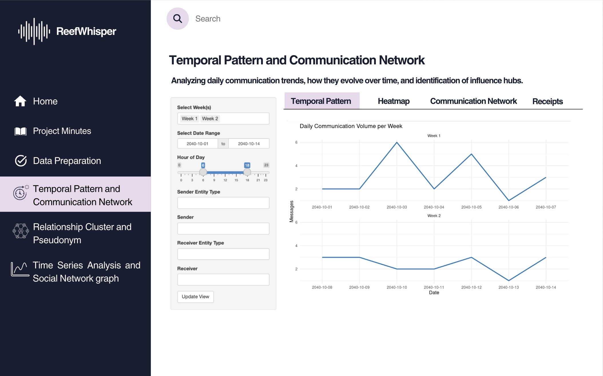{fig-align="center"}

#### [4.1.3.2]{style="color:#d496d4; background:none;"} **Heatmap**

Purpose: Explore patterns by time-of-day and communication density.

Design Elements:

-   Heatmap Matrix: Color-coded intensity based on message count by hour and date.

-   Color Scale: Darker hues represent higher volume.

Effective for isolating habitual communicators or unusual off-hour messages (potential signs of covert coordination).

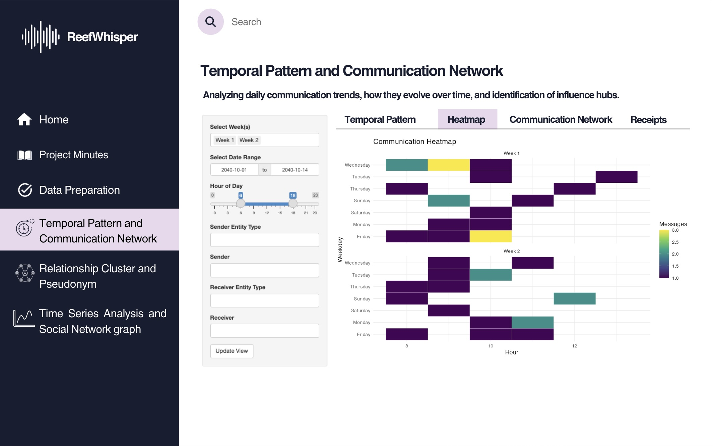{fig-align="center"}

#### [4.1.3.3]{style="color:#d496d4; background:none;"} **Communication Network**

Purpose: Visualize the social graph of communication.

Design Elements:

-   Force-Directed Graph: Nodes for people/vessels/organizations, edges for interactions.

-   Node Filtering: Allows selection by ID to isolate individuals.

This is key for identifying influence hubs, peripheral actors, and communication silos—crucial for mapping Nadia Conti’s hidden relationships.

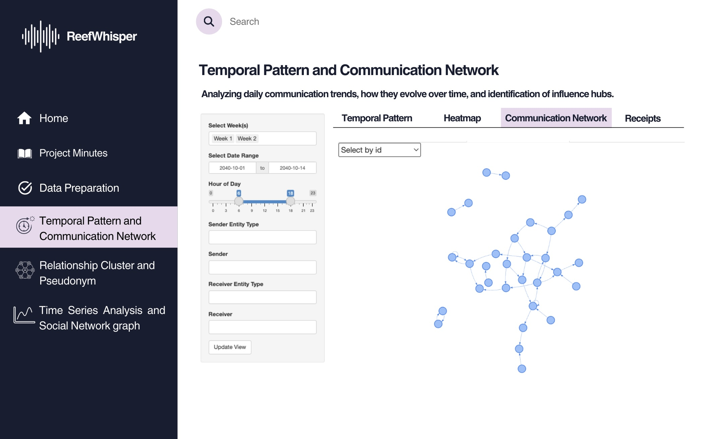{fig-align="center"}

#### [4.1.3.4]{style="color:#d496d4; background:none;"} **Receipts**

This tab allow users to read the communication messages (or as investigators we can call them receipts).

Purpose: Provide a full-text view of communication logs.

Design Elements:

-   Data Table: Shows message sender, receiver, timestamp, type, and raw message content.

-   Pseudonym Tracking: Enables Clepper to connect aliases across threads.

Useful for identifying suspicious message contents and linking disguised personas (e.g., Nadia Conti under a pseudonym) to known actors.

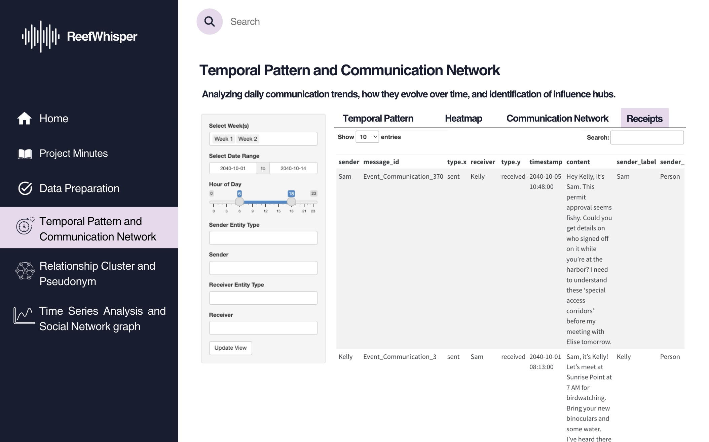{fig-align="center"}

### [4.1.4]{style="color:#d496d4; background:none;"} UI objects used

+-------------------------------------+--------------------------------------------------------------------------------------------+
| **UI Component**                    | **Purpose**                                                                                |
+-------------------------------------+--------------------------------------------------------------------------------------------+
| `titlePanel()`                      | App's title                                                                                |
+-------------------------------------+--------------------------------------------------------------------------------------------+
| `sidebarLayout()`                   | Two-column layout with input controls on the side and output in the main area              |
+-------------------------------------+--------------------------------------------------------------------------------------------+
| `tabsetPanel()`                     | Separate tabs for the different visualization                                              |
+-------------------------------------+--------------------------------------------------------------------------------------------+
| `selectInput()`                     | Select an entity or type (e.g., person, vessel), and Filter by Week Label (e.g., Week 1/2) |
+-------------------------------------+--------------------------------------------------------------------------------------------+
| `textInput()` or `selectizeInput()` | Allows one or more selection sender/receiver                                               |
+-------------------------------------+--------------------------------------------------------------------------------------------+
| `checkboxGroupInput()`              | Select multiple weeks or types                                                             |
+-------------------------------------+--------------------------------------------------------------------------------------------+
| `dateRangeInput()`                  | Filter by date range                                                                       |
+-------------------------------------+--------------------------------------------------------------------------------------------+
| `sliderInput()`                     | Filter by hour of day (0–23)                                                               |
+-------------------------------------+--------------------------------------------------------------------------------------------+
| `plotOutput()`                      | Static ggplot visualizations (content to be defined under `Server \<- function segment`)   |
+-------------------------------------+--------------------------------------------------------------------------------------------+
| `dataTableOutput()`                 | Render data table (content to be defined under `Server \<- function segment`)              |
+-------------------------------------+--------------------------------------------------------------------------------------------+
| `visNetworkOutput()`                | Interactive network graph (content to be defined under `Server \<- function segment`)      |
+-------------------------------------+--------------------------------------------------------------------------------------------+
| `actionButton()`                    | Apply filters                                                                              |
+-------------------------------------+--------------------------------------------------------------------------------------------+

### [4.1.5]{style="color:#d496d4; background:none;"} R packages needed for Shiny application {#rpkg}

As we will be adapting our Take Home Exercise 2 graphs to Shiny Application, we need to ensure that we have all the necessary R packages needed for this conversion such as:

-   [**shiny**](https://shiny.posit.co/){target="_blank"}**:** Easy web apps for data science without the compromises.
-   [**dplyr**](https://cran.r-project.org/package=dplyr){target="_blank"}: A grammar of data manipulation, making data wrangling concise, fast, and readable.
-   [**ggplot2**](https://cran.r-project.org/package=ggplot2){target="_blank"}: A versatile and widely used R package for creating elegant data visualizations based on the Grammar of Graphics.
-   [**visNetwork**](https://datastorm-open.github.io/visNetwork/){target="_blank"}: Enables interactive network visualizations in R using the vis.js JavaScript library.

### [4.1.6]{style="color:#d496d4; background:none;"} Test the specific R codes can be run {#prototype}

Most preparation have been done in [Take Home Exercise 2](https://isss608-vriadi.netlify.app/take-home_ex/take-home_ex02/take-home_ex02).

In this section we will prepare and test the specific R codes can be run in Shiny and return the correct output as expected.

**Scroll down and click "Update View" to load the visualization!**

### View on [{height="20"}](https://vriadi.shinyapps.io/reefwhispers_app1/){target="_blank"}

```{=html}
<div style="width: 100%; height: 600px; padding: 0; overflow: hidden;">
  <iframe 
    src="https://vriadi.shinyapps.io/reefwhispers_app1/" 
    title="CMAP-RSI Explorer"
    style="width: 135%; height: 135%; transform: scale(0.75); transform-origin: top left; border: none;">
  </iframe>
</div>
```

## [4.2]{style="color:#d496d4; background:none;"} App 2: Communication Clusters and Pseudonyms {#app2}

### [4.2.1]{style="color:#d496d4; background:none;"} UI Design Goals

-   Break down the interface into focused tabs for People & Vessels Communication Network And Cluster Detection, Predominant Topic Discovery, and Pseudonym Usage & Exploration.

-   Use expressive and interactive visuals (e.g., multi-cluster & force-directed relationship graph, filterable tables, searchable bar chart & heatmap) to highlight communicative interaction & clusters and pseudonymous insights in the people and vessels network.

-   Support investigative usability by enabling Clepper to uncover hidden communication tendency, closely associated groups, and individuals hidden under multiple aliases in the people and vessels network.

### [4.2.2]{style="color:#d496d4; background:none;"} Parameters and outputs that will be exposed on the Shiny applications

+------------------------------------------------------+-----------------------------------------------------------------------------------------------------------------------+
| **Parameters (UI Inputs)**                           | **Outputs (UI Outputs)**                                                                                              |
+======================================================+=======================================================================================================================+
| **Week Selection** (select box)                      | **All charts:** Charts filtered by the selected week(s)                                                               |
+------------------------------------------------------+-----------------------------------------------------------------------------------------------------------------------+
| **Date Range Input** (free-text boxes)               | **All charts:** Charts filtered by the specific selected date range                                                   |
+------------------------------------------------------+-----------------------------------------------------------------------------------------------------------------------+
| **Individual ID Selection** (dropdown)               | **Chart 1:** Force-directed network graph that highlights the selected ID and all directly connected nodes            |
+------------------------------------------------------+-----------------------------------------------------------------------------------------------------------------------+
| **Cluster Selection** (dropdown)                     | **Chart 1:** Force-directed network graph that highlights the selected cluster with all belonged nodes                |
+------------------------------------------------------+-----------------------------------------------------------------------------------------------------------------------+
| **Cluster Selection** (dropdown)                     | **Chart 2:** Table that displays top keywords mentioned in the messages of nodes belonging to the selected cluster    |
+------------------------------------------------------+-----------------------------------------------------------------------------------------------------------------------+
| **Number of Top Keywords Input** (free-text box)     | **Chart 2:** Table that shows top *k* keywords mentioned in the messages of nodes (belonging to the selected cluster) |
+------------------------------------------------------+-----------------------------------------------------------------------------------------------------------------------+
| **Threshold for Pseudonym Frequency Input** (slider) | **Chart 3:** Bar chart of pseudonyms whose frequency ≥ threshold                                                      |
+------------------------------------------------------+-----------------------------------------------------------------------------------------------------------------------+
| **Threshold for Pseudonym Mentions** (slider)        | **Chart 4:** Heatmap of pseudonym mentions with frequency ≥ threshold                                                 |
+------------------------------------------------------+-----------------------------------------------------------------------------------------------------------------------+

### [4.2.3]{style="color:#d496d4; background:none;"} Shiny App Panel Tabs UI Design

#### [4.2.3.1]{style="color:#d496d4; background:none;"} **Communication Clusters**

Purpose: Reveal the interactions & relationships among people and vessels as well as the tightly knit groups.

Design Elements:

-   Force-directed network graph: Visualizes entities (people & vessels) and their interactions, with distinct color-coded clusters.

-   Interactive Controls: Week selection and date range slider.

-   Dropdowns to filter by individual ID (where selecting an ID highlights that node and its directly-related nodes only) or communication cluster (where selecting a cluster highlights the nodes belonging to that cluster only).

This helps Clepper better understand the interactions & relationships among people and vessels in the knowledge graph, detect central & supporting actors, identify hidden groupings, and see how communication flows within clusters.

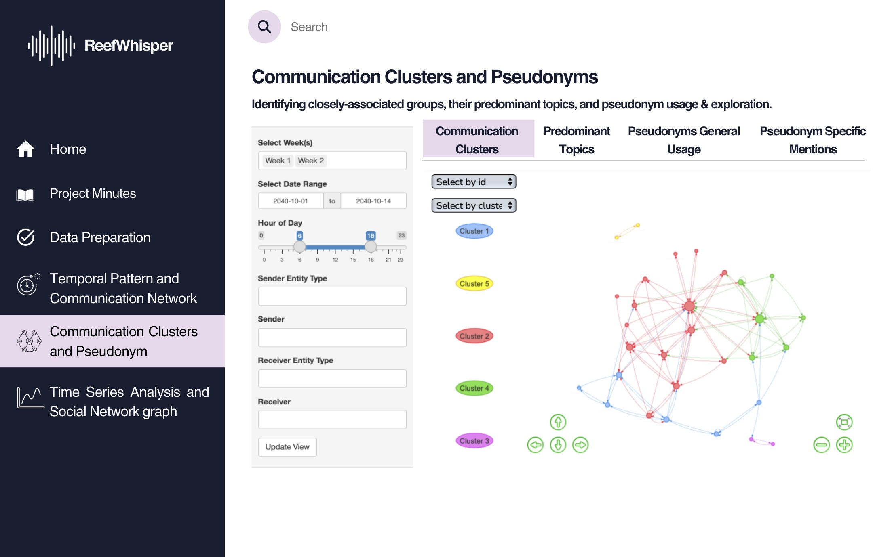{fig-align="center"}

#### [4.2.3.2]{style="color:#d496d4; background:none;"} **Predominant Topics**

Purpose: Reveal the predominant topics discussed within each communication cluster.

Design Elements:

-   Keyword frequency table: Displays the most common words used by members of each cluster and their frequency.

-   Interactive Controls: Week selection and date range slider.

-   Dropdown to filter by communication cluster, where selecting a cluster filters the keywords to those used only by that group.

-   Free-text box to enter the number of top used keywords that the user wants to be displayed.

This helps Clepper see what each group is talking about, understand their interests and operations, and identify their predominant topics. It also offers context to uncover entities hidden behind the pseudonyms used in each cluster.

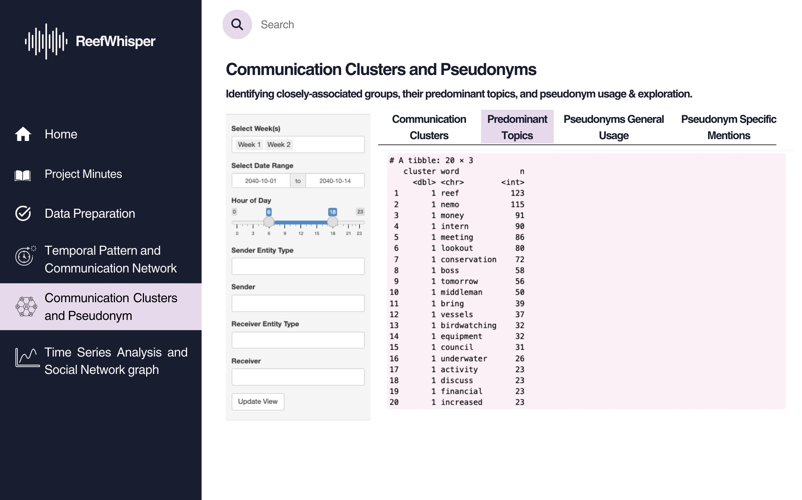{fig-align="center"}

#### [4.2.3.3]{style="color:#d496d4; background:none;"} **Pseudonyms General Usage**

Purpose: Quantify how frequently identified and suspected pseudonyms appear in communications.

Design Elements:

-   Bar chart: Displays total mention counts of selected pseudonyms across all messages of people and vessels in the network, ranked from highest to lowest frequency to aid visual comparison.

-   Interactive Controls: Week selection and date range slider.

-   Slider to set pseudonym frequency threshold: Users can filter for the only pseudonyms whose frequency satisfies a certain minimum threshold to reduce noise.

This helps Clepper prioritize which 'names' has higher potential of being pseudonyms and which pseudonyms warrant further investigation based on communication volume.

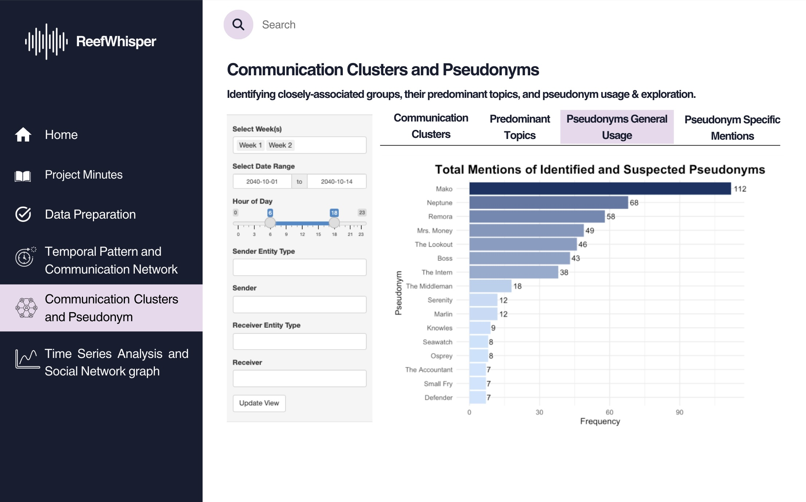{fig-align="center"}

#### [4.2.3.4]{style="color:#d496d4; background:none;"} **Pseudonyms Specific Mentions**

Purpose: Show which entities mention which pseudonyms, and how frequently, to uncover possible hidden identities.

Design Elements:

-   Heatmap matrix: Displays senders (rows) and pseudonyms mentioned (columns), with fill intensity based on frequency.

-   Labelled counts: Cells display the number of times a sender referenced a particular pseudonym.

-   Interactive Controls: Week selection and date range slider.

-   Slider to set pseudonym mention frequency threshold: Users can filter for the only number of mentions that satisfy a certain minimum threshold to reduce noise.

This helps Clepper better uncover identities hidden behind pseudonyms.

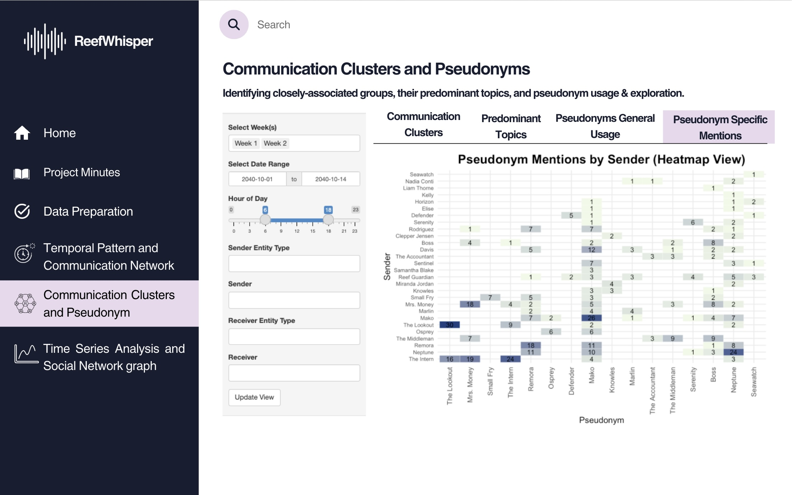{fig-align="center"}

### [4.2.4]{style="color:#d496d4; background:none;"} UI objects used
+------------------------+---------------------------------------------------------------------------------------------------------+
| **UI Component**       | **Purpose**                                                                                             |
+------------------------+---------------------------------------------------------------------------------------------------------+
| **titlePanel()**       | App’s title                                                                                             |
+------------------------+---------------------------------------------------------------------------------------------------------+
| **sidebarLayout()**    | Two-column layout with input controls on the side and visual output in the main panel                   |
+------------------------+---------------------------------------------------------------------------------------------------------+
| **tabsetPanel()**      | Switch between the 4 modules: Communication Clusters, Predominant Topics, Pseudonym Usage, and Mentions |
+------------------------+---------------------------------------------------------------------------------------------------------+
| **selectInput()**      | Select by ID, select by cluster, or filter pseudonym-related terms                                      |
+------------------------+---------------------------------------------------------------------------------------------------------+
| **textInput()**        | Free-text input to define number of top keywords to display                                             |
+------------------------+---------------------------------------------------------------------------------------------------------+
| **sliderInput()**      | Filter by hour of day or set pseudonym frequency threshold                                              |
+------------------------+---------------------------------------------------------------------------------------------------------+
| **dateRangeInput()**   | Filter communications by selected date range                                                            |
+------------------------+---------------------------------------------------------------------------------------------------------+
| **plotOutput()**       | Render static ggplot visualizations (bar chart or heatmap)                                              |
+------------------------+---------------------------------------------------------------------------------------------------------+
| **dataTableOutput()**  | Display top keyword frequency table for selected cluster                                                |
+------------------------+---------------------------------------------------------------------------------------------------------+
| **visNetworkOutput()** | Show interactive communication cluster graph                                                            |
+------------------------+---------------------------------------------------------------------------------------------------------+
| **actionButton()**     | Apply filters or refresh views                                                                          |
+------------------------+---------------------------------------------------------------------------------------------------------+

### [4.2.5]{style="color:#d496d4; background:none;"} R packages needed for Shiny application

As we will be adapting the visual analytics from Take-home Exercise 2 into a Shiny application, we need to ensure all required R packages are available and supported. The following packages are essential for building and rendering this application:

-   [**shiny**](https://shiny.posit.co/){target="_blank"}**:** Easy web apps for data science without the compromises.
-   [**dplyr**](https://cran.r-project.org/package=dplyr){target="_blank"}: A grammar of data manipulation, making data wrangling concise, fast, and readable.
-   [**ggplot2**](https://cran.r-project.org/package=ggplot2){target="_blank"}: A versatile and widely used R package for creating elegant data visualizations based on the Grammar of Graphics.
-   [**visNetwork**](https://datastorm-open.github.io/visNetwork/){target="_blank"}: Enables interactive network visualizations in R using the vis.js JavaScript library.
tidyr: Helps reshape data for plotting and joins, especially useful for keyword tables and pseudonym mentions.
-   [**stringr**](https://stringr.tidyverse.org/): Provides a cohesive set of functions designed to make string manipulation easier and more consistent (used for detecting pseudonym references).
-   [**forcats**](https://forcats.tidyverse.org/): Tools for working with categorical/factor variables — particularly useful in heatmap axis ordering.

### [4.2.6]{style="color:#d496d4; background:none;"} Test the specific R codes can be run

**WIP**

## [4.3]{style="color:#d496d4; background:none;"} App 3: Time Series Analysis and Social Network Graph {#app3}

### [4.3.1]{style="color:#d496d4; background:none;"} UI Design Goals

**1. Clarity and Visual Hierarchy: Ensure users can easily understand the content and navigation**

-   Consistent layout and side navigation menu
-   Tabs (“Temporal Pattern,” “Direct Relationship Network,” etc.) clearly segment tasks
-   Color-coded charts and graphs (e.g., pie chart, bar chart, network nodes) allow users to distinguish entities and event types at a glance.

**2. Interactive Exploration: Enable users to dynamically filter, explore, and uncover patterns or relationships**

-   Filters by week, date, hour, sender/receiver type and ID.
-   Interactive graphs (e.g., relationship graph, timeline of evidence events)
-   Tooltips and hover-over interactivity provide contextual information without cluttering the interface.

**3. Temporal and Contextual Insight: Help users identify when and how Nadia Conti was involved in activities**

-   Temporal bar charts showing frequency and patterns by hour/day.
-   Timeline views mapping keywords, operational focus, and evidence events to specific dates.
-   Consistent use of timeline metaphors (e.g., “Oct 8–12” axis)

### [4.3.2]{style="color:#d496d4; background:none;"} Parameters and outputs that will be exposed on the Shiny applications

+---------------------------------------------------------------------------------------+-------------------------------------------------------------------------------------------+
| **Parameters (UI Inputs)**                                                            | **Outputs (UI Outputs)**                                                                  |
+=======================================================================================+===========================================================================================+
| **Entity Filter** (person, vessel, location, organization, pseudonym)                 | \- Interactive network graph (direct and inferred connections via visNetwork)             |
+---------------------------------------------------------------------------------------+-------------------------------------------------------------------------------------------+
| **Week Selection** (Week 1 / Week 2 toggle)                                           | \- Pie chart: Sent vs. received messages                                                  |
+---------------------------------------------------------------------------------------+-------------------------------------------------------------------------------------------+
| **Date Range Input** (subset time range: e.g., 2040-10-01 to 2040-10-14)              | \- Bar chart of message frequency by hour/day                                             |
+---------------------------------------------------------------------------------------+-------------------------------------------------------------------------------------------+
| **Hour Range Input** (slider to subset by hour of day)                                | \- Temporal pattern plot of messages mentioning selected entities                         |
+---------------------------------------------------------------------------------------+-------------------------------------------------------------------------------------------+
| **Sender Entity Type & Input** (free text or dropdown)                                | \- Timeline of operational focuses and evidence events                                    |
+---------------------------------------------------------------------------------------+-------------------------------------------------------------------------------------------+
| **Receiver Entity Type & Input** (free text or dropdown)                              | \- Keyword frequency bar chart by selected date                                           |
+---------------------------------------------------------------------------------------+-------------------------------------------------------------------------------------------+
| **Graph Type Selection** (toggle: full network vs. person-to-person view)             | \- Evidence timeline chart with hover-to-view conversations                               |
+---------------------------------------------------------------------------------------+-------------------------------------------------------------------------------------------+
| **Message Filter by ID** (dropdown/select box to inspect conversation thread)         | \- Filtered table or tooltip displaying sender, receiver, message, and timestamp          |
+---------------------------------------------------------------------------------------+-------------------------------------------------------------------------------------------+
| **Tab Selection** (Temporal Pattern, Direct Relationship, Relationship Network, etc.) | \- Dynamic tab-specific visualizations based on focus (e.g., events, keywords, timelines) |
+---------------------------------------------------------------------------------------+-------------------------------------------------------------------------------------------+

### [4.3.3]{style="color:#d496d4; background:none;"} Shiny App Panel Tabs UI Design

#### [4.3.3.1]{style="color:#d496d4; background:none;"} **Overview and Temporal of Nadia Conti’s activity**

**Purpose:**\
Reveal Nadia Conti’s communication rhythm by analyzing message volume, frequency, and time-of-day patterns.

**Design Elements:**

-   **Pie Chart:** Shows the proportion of messages sent vs. received by Nadia.
-   **Bar Charts:**
    -   Communication frequency by hour and day across the selected time window.\
    -   Temporal pattern of messages that mention Nadia.
-   **Interactive Controls:**
    -   Week selection (`checkboxGroupInput`: Week 1 / Week 2).\
    -   Date range input (`dateRangeInput`: subset to Oct 1–14, 2040).\
    -   Hour-of-day filter (`sliderInput`).
-   **Text Fields & Filters:**
    -   `selectInput` for sender/receiver entity type (e.g., person, vessel, organization).

**Insight:**\
This tab helps Clepper detect **temporal anomalies** or bursts of communication involving Nadia — such as sharp increases in messages during suspicious hours, or leading up to events like **Reef access cancellations** or **unexpected ship movements**.

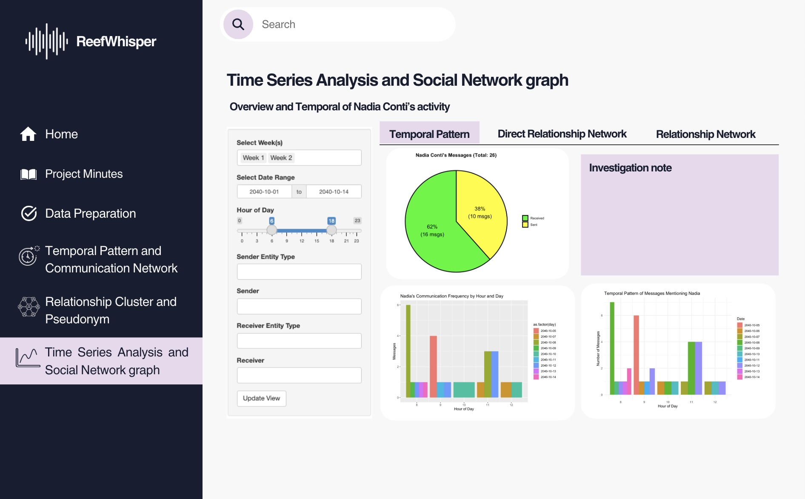{fig-align="center"}

#### [4.3.3.2]{style="color:#d496d4; background:none;"} **Direct Relationship Network Tab**

**Purpose:**\
Visualize Nadia Conti’s direct connections with individuals, organizations, vessels, and locations to understand communication flow and interaction strength.

**Design Elements:**

-   **Interactive Network Graph (`visNetworkOutput`)**:
    -   Displays directional links between Nadia and other entities.\
    -   Node colors differentiate entity types (e.g., person, vessel, organization, location).\
    -   Edge thickness reflects communication frequency.
-   **Select by ID Dropdown (`selectInput`)**:
    -   Allows users to isolate and explore Nadia’s direct communication with a specific entity.
-   **Filters on the Left Sidebar:**
    -   Date range and hour-of-day filters to refine the timeline window.\
    -   Sender and receiver type filters (e.g., vessel, city council, individual).

**Insight:**\
This view helps analysts pinpoint Nadia’s **most active communication partners**, detect **asymmetrical message exchanges** (e.g., one-way reports or commands), and highlight clusters of influence. For instance, frequent interactions with **Sailor Shifts Team**, **Neptune**, and **V. Miesel Shipping** may indicate operational dependencies or hidden hierarchies.

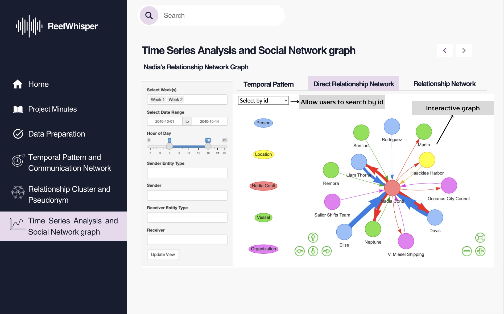{fig-align="center"}

#### [4.3.3.3]{style="color:#d496d4; background:none;"} **Relationship Network Tab**

**Purpose:**\
Uncover Nadia Conti’s extended network structure, including both direct and indirect communication events, to trace relationships and evidence paths.

**Design Elements:**

-   **Interactive Network Graph (`visNetworkOutput`)**:
    -   Visualizes full interaction web with Nadia at the center.\
    -   Shows links not only between Nadia and entities, but also among events and inferred connections.\
    -   Arrows indicate communication direction; node size and color reflect event type or role (e.g., communication logs, colleagues, vessels).
-   **Select by ID Dropdown (`selectInput`)**:
    -   Enables investigators to filter and isolate a specific communication node or trace its related paths.
-   **Entity Legend on Sidebar:**
    -   Helps users decode node categories: Person, Vessel, Organization, Location, Event, etc.
-   **Time Filters:**
    -   Date and hour-of-day sliders to narrow the communication window for clarity.

**Insight:**\
This view allows analysts to trace **complex interactions**, uncover **hidden intermediaries**, and build narratives across **multiple touchpoints**. It’s particularly useful when linking Nadia’s communications to suspicious events like covert meetings, unusual routing, or unauthorized access involving others like **Colleagues**, **Sailor Shifts Team**, or **Event_Communication_537**.

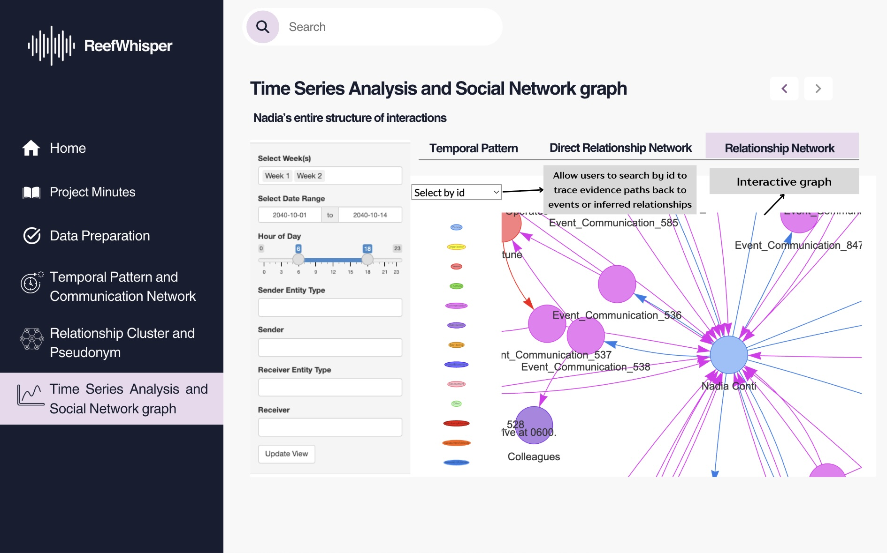{fig-align="center"}

#### [4.3.3.4]{style="color:#d496d4; background:none;"} **Keyword Timeline Tab**

**Purpose:**\
Identify shifts in the focus of communication by analyzing frequently used keywords in Nadia-related messages, broken down by day.

**Design Elements:**

-   **Bar Chart (`plotOutput`)**:
    -   Displays top keywords in Nadia’s messages per selected date.\
    -   Helps highlight topic spikes or recurring themes (e.g., “reef,” “payment,” “equipment”).
-   **Date Tabs (October 8–12)**:
    -   Allow users to navigate across individual days to track changes in message content.
-   **Interactive Controls on Sidebar:**
    -   Week and date range selectors (`checkboxGroupInput`, `dateRangeInput`).\
    -   Hour-of-day filter (`sliderInput`) to narrow keyword search to specific communication windows.

**Insight:**\
This tab enables Clepper to **detect emerging concerns** or **investigative leads**. For example, a surge in keywords like *“tomorrow,” “finalize,” “reef,”* or *“mako”* on October 8 may indicate a prelude to operational actions such as site closures, hidden meetings, or shipment planning.

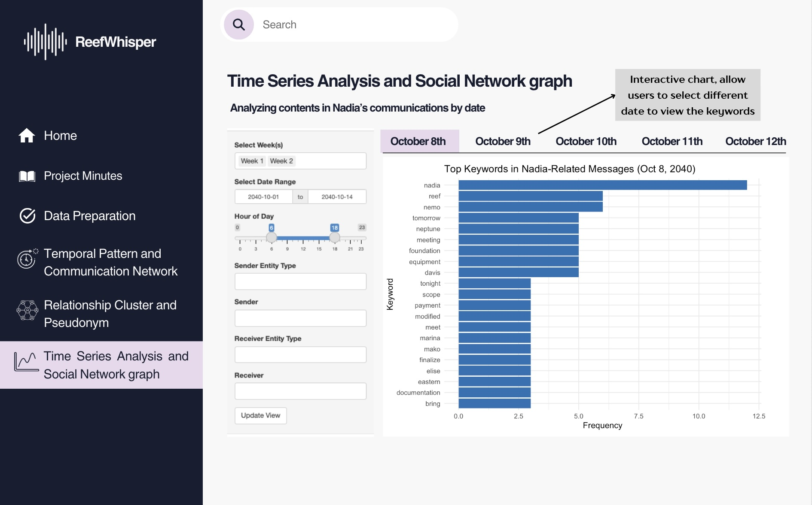{fig-align="center"}

#### [4.3.3.5]{style="color:#d496d4; background:none;"} **Operational Focus Tab**

**Purpose:**\
Map the progression of Nadia’s involvement in operational activities over time, categorized by event type and strategic focus.

**Design Elements:**

-   **Timeline of Operational Focus (`plotOutput`)**:
    -   Displays day-by-day breakdown of Nadia's involvement in major categories such as *Execution Planning*, *Escalation Response*, *Surveillance*, and more (Oct 8–12, 2040).
-   **Stacked Bar Chart (Event Types Over Time)**:
    -   Shows Nadia’s message volume classified by primary event types (e.g., General, Patrol, Permit, Coordination).
-   **Heatmap of Actor Involvement (`plotOutput`)**:
    -   Reveals which individuals or groups were most frequently associated with specific event types.
-   **Interactive Filters on Sidebar:**
    -   Week, date, and hour range filters to narrow scope.\
    -   Sender/receiver type inputs for customizing actor focus.

**Insight:**\
This view helps investigators understand Nadia’s **daily roles in the broader operation**, revealing potential leadership, coordination, or compliance patterns. For example, a spike in “Permit”-related activity involving **V. Miesel Shipping** and **Nadia Conti** suggests her critical role in legal maneuvering or document approvals around October 12.

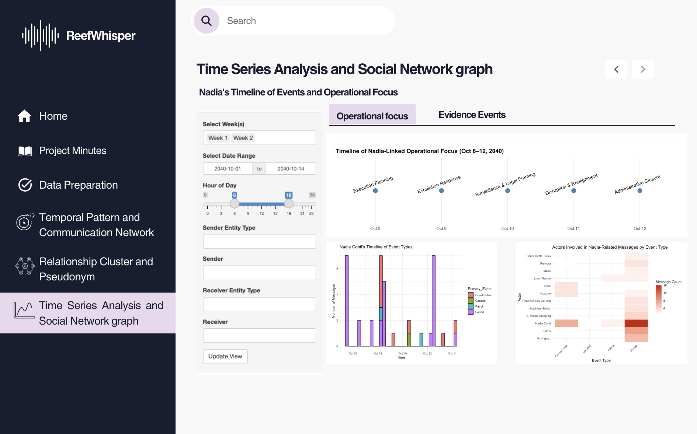{fig-align="center"}

#### [4.3.3.6]{style="color:#d496d4; background:none;"} **Evidence Events Tab**

**Purpose:**\
Visualize and trace specific pieces of evidence involving Nadia over time, categorized by type and associated actors.

**Design Elements:**

-   **Scatter Plot Timeline (`plotOutput`)**:
    -   Plots individual evidence events by type (e.g., Assessment, Movement, Patrol, Administrative).\
    -   Y-axis shows event type; X-axis shows exact date/timestamp.\
    -   Each dot is interactive—hovering reveals the full conversation or description, and the actors involved.
-   **Color Legend:**
    -   Distinguishes which parties are linked to each piece of evidence (e.g., Davis & Rodriguez, Elise & Nadia, Sentinel & Nadia).
-   **Sidebar Filters:**
    -   Week, date, and hour range controls help isolate specific time frames.\
    -   Sender/receiver filters narrow focus to targeted communications.

**Insight:**\
This tab helps investigators **reconstruct key moments** using concrete communication evidence. For instance, the blue-labeled *“Access_Cancellation”* event shows that **Nadia revoked access to Nemo Reef**, while pink and red markers around October 4–5 indicate possible surveillance and traffic anomalies—signaling hidden activity or pre-event coordination.

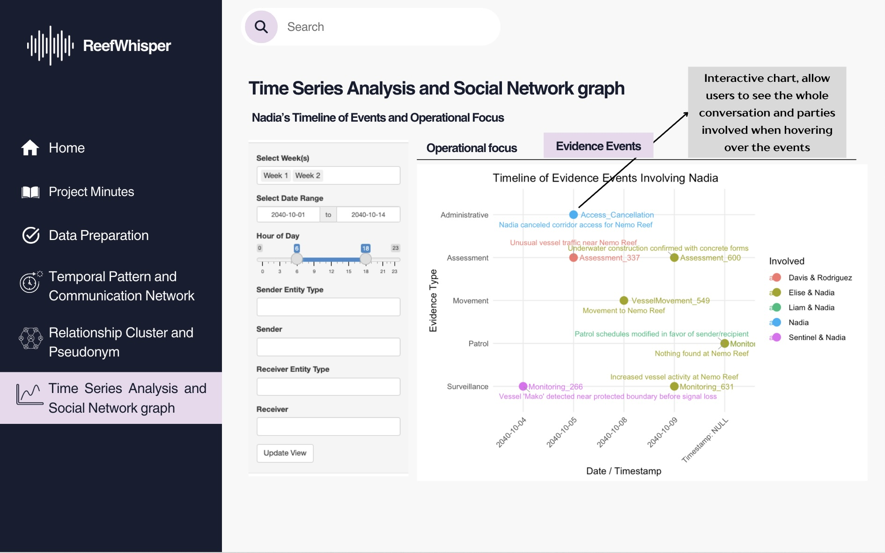{fig-align="center"}

### [4.3.4]{style="color:#d496d4; background:none;"} UI objects used

+-------------------------------------+---------------------------------------------------------------------------------+
| **UI Component**                    | **Purpose**                                                                     |
+=====================================+=================================================================================+
| `titlePanel()`                      | App’s title                                                                     |
+-------------------------------------+---------------------------------------------------------------------------------+
| `sidebarLayout()`                   | Two-column layout with input controls on the side and output in the main area   |
+-------------------------------------+---------------------------------------------------------------------------------+
| `tabsetPanel()`                     | Separate tabs for different visualizations                                      |
+-------------------------------------+---------------------------------------------------------------------------------+
| `selectInput()`                     | Select an entity or type (e.g., person, vessel), or filter by week (Week 1 / 2) |
+-------------------------------------+---------------------------------------------------------------------------------+
| `textInput()` or `selectizeInput()` | Input for sender or receiver (supports free-text or multiple selection)         |
+-------------------------------------+---------------------------------------------------------------------------------+
| `checkboxGroupInput()`              | Select multiple weeks or entity types                                           |
+-------------------------------------+---------------------------------------------------------------------------------+
| `dateRangeInput()`                  | Filter messages by date range                                                   |
+-------------------------------------+---------------------------------------------------------------------------------+
| `sliderInput()`                     | Filter by hour of day (0–23)                                                    |
+-------------------------------------+---------------------------------------------------------------------------------+
| `plotOutput()`                      | Display `ggplot2` visualizations (defined in the `server` function)             |
+-------------------------------------+---------------------------------------------------------------------------------+
| `dataTableOutput()`                 | Render filtered communication tables (defined in the `server` function)         |
+-------------------------------------+---------------------------------------------------------------------------------+
| `visNetworkOutput()`                | Display the interactive relationship graph (defined in the `server` function)   |
+-------------------------------------+---------------------------------------------------------------------------------+
| `actionButton()`                    | Apply or refresh filters                                                        |
+-------------------------------------+---------------------------------------------------------------------------------+

### [4.3.5]{style="color:#d496d4; background:none;"} R packages needed for Shiny application

To support the interactive features and visualizations in the Shiny application, the following R packages are required:

-   `shiny`: Builds interactive web applications directly from R.
-   `dplyr`: Provides fast, concise data wrangling using a consistent grammar.
-   \`ggplot2: Enables elegant and flexible data visualizations using the Grammar of Graphics.
-   `visNetwork`: Creates interactive network visualizations using the vis.js JavaScript library in R.

### [4.3.6]{style="color:#d496d4; background:none;"} Test the specific R codes can be run

**WIP**

# [5]{style="color:#d496d4; background:none;"} Reference

-   [VAST 2024 Mini Challenge 3](https://vast-challenge.github.io/2025/MC3.html){target="_blank"}

-   [Take Home Exercise 2](https://isss608-vriadi.netlify.app/take-home_ex/take-home_ex02/take-home_ex02)

-   [Hoa's Take Home Exercise 2](https://isss608-ay2024-25t.netlify.app/take-home_ex/take-home_ex02/take-home_ex02)

-   [Summer's Take Home Exercise 2](https://summernguyenn.netlify.app/take-home_ex/take-home_ex02/take-home_ex02)\

## [5.1]{style="color:#d496d4; background:none;"} R Packages

-   [shiny](https://shiny.posit.co/){target="_blank"}: Easy web apps for data science without the compromises.
-   [dplyr](https://cran.r-project.org/package=dplyr){target="_blank"}: A grammar of data manipulation, making data wrangling concise, fast, and readable.
-   [ggplot2](https://cran.r-project.org/package=ggplot2){target="_blank"}: A versatile and widely used R package for creating elegant data visualizations based on the Grammar of Graphics.
-   [visNetwork](https://datastorm-open.github.io/visNetwork/){target="_blank"}: Enables interactive network visualizations in R using the vis.js JavaScript library.

## [5.2]{style="color:#d496d4; background:none;"} Shiny Fuctional Specs and Tutorials

## [5.3]{style="color:#d496d4; background:none;"} Lesson Slides

-   [Lesson 6a: Shiny Basic](../lesson/Lesson06/Shiny1/Shiny1.html)
-   [Lesson 6b: Shiny Reactivity](../lesson/Lesson06/Shiny2/Shiny2.html)
-   [Lesson 6c: Beyond Basic Basic](../lesson/Lesson06/Shiny3/Shiny3.html)

## [5.4]{style="color:#d496d4; background:none;"} Shiny Fuctional Specs and Tutorials

-   [Shiny from R Studio](https://shiny.rstudio.com/)
-   [Learn Shiny](https://shiny.rstudio.com/tutorial/)
-   [Function reference](http://shiny.rstudio.com/reference/shiny/latest/)
-   [The Shiny Cheat sheet](https://shiny.rstudio.com/images/shiny-cheatsheet.pdf)
