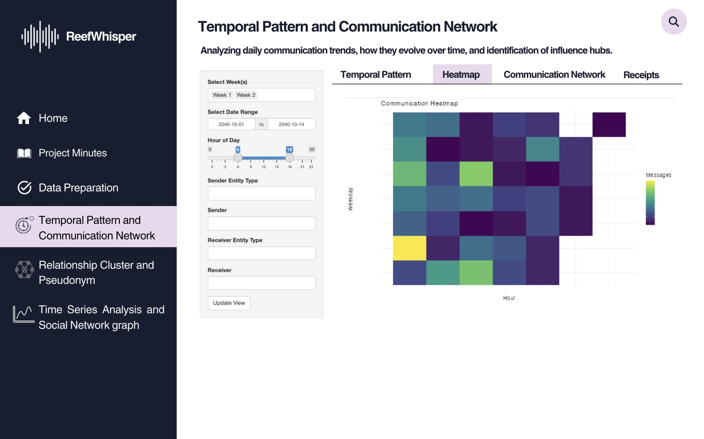

# [1]{style="color:#d496d4; background:none;"} Overview

Still in the same storyline with the previous [Take Home Exercise 2](https://isss608-vriadi.netlify.app/take-home_ex/take-home_ex02/take-home_ex02), Clepper Jessen, an investigative journalist, is uncovering possible corruption in Oceanus linked to the closure of Nemo Reef and the arrival of pop star Sailor Shift. Using intercepted radio communications, a knowledge graph was created to map out interactions between people, vessels, and organizations. This Mini Challenge aims to support Clepper's investigation through data-driven visual analytics, uncovering patterns, pseudonym usage, social groupings, and suspicious behavior—especially concerning Nadia Conti, a previously implicated figure in illegal fishing.

This is part 1 of the entire Mini Challenge 3 where we will be working as a group to create different approaces to uncover these whispers!

# [2]{style="color:#d496d4; background:none;"} Objective

Base on the previous [Take Home Exercise 2](https://isss608-vriadi.netlify.app/take-home_ex/take-home_ex02/take-home_ex02), this take home exercise 3 objective is to:

-   Evaluate and determine the necessary R packages needed for your Shiny application are supported in R CRAN
-   Prepare and test the specific R codes can be run and returned the correct output as expected
-   Determine the parameters and outputs that will be exposed on the Shiny applications, and
-   Select the appropriate Shiny UI components for exposing the parameters determine above.

# [2.1]{style="color:#d496d4; background:none;"} Storyboard

For this part 1 we will be focusing on:

-   Identify temporal patterns in communications.

-   Reveal relationships and influence among entities (people, vessels, groups).

-   Expose pseudonym usage and investigate Nadia Conti’s activity for potential misconduct.

Hence, we will be looking at a Shiny web app that allows user to explore the temporal interpolation and heatmap of the communication pattern, as well as the communication network graph to see the relationships and influence among the entities. Through this, user is able to uncover the above agendas. We will be splitting this app into 4 main section that will be further detailed in [Chapter 6](#uidesign).

::: {.nursebox .nurse data-latex="nurse"}
Other than the first part, we will also be uncovering other parts separately. Check them out! 

Part 2 - Relationship Cluster and Pseudonym: [Hoa's Take Home Exercise 2](https://isss608-ay2024-25t.netlify.app/take-home_ex/take-home_ex02/take-home_ex02)

Part 3 - Time Series Analysis and Social Network graph: [Summer's Take Home Exercise 2](https://summernguyenn.netlify.app/take-home_ex/take-home_ex02/take-home_ex02)
:::

# [3]{style="color:#d496d4; background:none;"} R packages needed for Shiny application

As we will be adapting our Take Home Exercise 2 graphs to Shiny Application, we need to ensure that we have all the necessary R packages needed for this conversion such as:

-   [**shiny**](https://shiny.posit.co/){target="_blank"}**:** Easy web apps for data science without the compromises.
-   [**dplyr**](https://cran.r-project.org/package=dplyr){target="_blank"}: A grammar of data manipulation, making data wrangling concise, fast, and readable.
-   [**ggplot2**](https://cran.r-project.org/package=ggplot2){target="_blank"}: A versatile and widely used R package for creating elegant data visualizations based on the Grammar of Graphics.
-   [**visNetwork**](https://datastorm-open.github.io/visNetwork/){target="_blank"}: Enables interactive network visualizations in R using the vis.js JavaScript library.

# [4]{style="color:#d496d4; background:none;"} Test the specific R codes can be run

Most preparation have been done in [Take Home Exercise 2](https://isss608-vriadi.netlify.app/take-home_ex/take-home_ex02/take-home_ex02).

In this section we will prepare and test the specific R codes can be run and returned the correct output as expected.

First we load the requred R packages:

```{r}
#| code-fold: true
pacman::p_load(tidyverse, tidygraph, ggraph, jsonlite, ggplot2,
               SmartEDA, lubridate, ggthemes, readr, readxl, knitr, dplyr, visNetwork)
```

Next we load the data in

```{r}
#| code-fold: true
comm_full <- read.csv("data/communications_full.csv")
head(comm_full)
```

## [4.1]{style="color:#d496d4; background:none;"} Temporal Pattern

```{r}
#| code-fold: true
comm_full %>%
  count(week_label, date) %>%
  ggplot(aes(x = date, y = n, group = week_label)) +
  geom_line(color = "steelblue", size = 1.2) +
  facet_wrap(~ week_label, scales = "free_x", ncol = 1, labeller = label_value) +
  labs(
    title = "Daily Communication Volume Per Week",
    x = "Date", y = "Number of Messages"
  ) +
  theme_minimal()
```

## [4.2]{style="color:#d496d4; background:none;"} Communication Heatmap

```{r}
#| code-fold: true
comm_hourly_weekly <- comm_full %>%
  count(week_label, weekday, hour)

ggplot(comm_hourly_weekly, aes(x = hour, y = weekday, fill = n)) +
  geom_tile(color = "white") +
  scale_fill_viridis_c(option = "plasma", name = "Message Count") +
  labs(title = "Communication Intensity by Hour and Weekday",
       x = "Hour of Day", y = "Day of Week") +
  facet_wrap(~ week_label, ncol = 1) +
  theme_minimal()

```

## [4.3]{style="color:#d496d4; background:none;"} Communication Network Graph

```{r}
#| code-fold: true
# Create edge list
graph_edges <- comm_full %>%
  count(sender_label, receiver_label) %>%
  filter(!is.na(sender_label), !is.na(receiver_label)) %>%
  rename(from = sender_label, to = receiver_label, value = n)

# Create node list from edges
graph_nodes <- tibble(name = unique(c(graph_edges$from, graph_edges$to))) %>%
  mutate(id = name, label = name, group = name)

# visNetwork expects numeric node IDs, but we can use labels for both
visNetwork(nodes = graph_nodes, edges = graph_edges) %>%
  visEdges(arrows = "to") %>%
  visOptions(highlightNearest = TRUE, nodesIdSelection = TRUE) %>%
  visLayout(randomSeed = 123) %>%
  visPhysics(stabilization = TRUE) %>%
  visInteraction(navigationButtons = TRUE) %>%
  visLegend()
```

# [5]{style="color:#d496d4; background:none;"} Parameters and outputs that will be exposed on the Shiny applications

+-------------------------------------------------------------------+-----------------------------------------------------------------------------+
| **Parameters (UI Inputs):**                                       | **Outputs (UI Outputs):**                                                   |
+===================================================================+=============================================================================+
| -   Entity filter (e.g., person, vessel, pseudonym, organization) | -   Line plot of communication volume over time                             |
|                                                                   |                                                                             |
| -   Week selection: Week 1 / Week 2                               | -   Heatmap of communication intensity by weekday/hour                      |
|                                                                   |                                                                             |
| -   Date range input (subset communication dates)                 | -   Interactive visNetwork graph                                            |
|                                                                   |                                                                             |
| -   Hour range input (to analyze time-of-day patterns)            | -   Filtered table of communications (sender, receiver, message, timestamp) |
|                                                                   |                                                                             |
| -   Sender / Receiver entity selection                            |                                                                             |
|                                                                   |                                                                             |
| -   Graph type: Full vs. person-to-person communication           |                                                                             |
+-------------------------------------------------------------------+-----------------------------------------------------------------------------+

# [6]{style="color:#d496d4; background:none;"} UI Design & Prototype {#uidesign}

## [6.1]{style="color:#d496d4; background:none;"} Overall UI Design

{fig-align="center"}

### [6.1.2]{style="color:#d496d4; background:none;"} Temporal Pattern

**WIP**

### [6.1.3]{style="color:#d496d4; background:none;"} Heatmap

**WIP**

### [6.1.4]{style="color:#d496d4; background:none;"} Communication Network

**WIP**

### [6.1.5]{style="color:#d496d4; background:none;"} Receipts
This tab allow users to read the communication messages (or as investigators we can call them receipts). 

**WIP**

## [6.2]{style="color:#d496d4; background:none;"} Prototype

**Scroll down and click "Update View" to load the visualization!**

### View on [{height="20"}](https://vriadi.shinyapps.io/reefwhispers_proto1/){target="_blank"}

```{=html}
<div style="width: 100%; height: 600px; padding: 0; overflow: hidden;">
  <iframe 
    src="https://vriadi.shinyapps.io/reefwhispers_proto1/" 
    title="CMAP-RSI Explorer"
    style="width: 135%; height: 135%; transform: scale(0.75); transform-origin: top left; border: none;">
  </iframe>
</div>

```

+-------------------------------------+----------------------------------------------------------------------------------------+
| **UI Component**                    | **Use**                                                                                |
+=====================================+========================================================================================+
| `titlePanel()`                      | App's title                                                                            |
+-------------------------------------+----------------------------------------------------------------------------------------+
| `sidebarLayout()`                   | Two-column layout with input controls on the side and output in the main area          |
+-------------------------------------+----------------------------------------------------------------------------------------+
| `tabsetPanel()`                     | Separate tabs for the different visualization                                          |
+-------------------------------------+----------------------------------------------------------------------------------------+
| `selectInput()`                     | Select an entity or type (e.g., person, vessel), and Filter by Week Label (e.g., Week 1/2)|
+-------------------------------------+----------------------------------------------------------------------------------------+
| `textInput()` or `selectizeInput()` | Allows one or more selection sender/receiver                                           |
+-------------------------------------+----------------------------------------------------------------------------------------+
| `checkboxGroupInput()`              | Select multiple weeks or types                                                         |
+-------------------------------------+----------------------------------------------------------------------------------------+
| `dateRangeInput()`                  | Filter by date range                                                                    |
+-------------------------------------+----------------------------------------------------------------------------------------+
| `sliderInput()`                     | Filter by hour of day (0–23)                                                           |
+-------------------------------------+----------------------------------------------------------------------------------------+
| `plotOutput()`                      | Static ggplot visualizations (content to be defined under Server \<- function segment) |
+-------------------------------------+----------------------------------------------------------------------------------------+
| `dataTableOutput()`                 | Render data table (content to be defined under Server \<- function segment)            |
+-------------------------------------+----------------------------------------------------------------------------------------+
| `visNetworkOutput()`                | Interactive network graph (content to be defined under Server \<- function segment)    |
+-------------------------------------+----------------------------------------------------------------------------------------+
| `actionButton()`                | Apply filters    |
+-------------------------------------+----------------------------------------------------------------------------------------+

# [7]{style="color:#d496d4; background:none;"} Reference

\- [VAST 2024 Mini Challenge 3](https://vast-challenge.github.io/2025/MC3.html){target="_blank"}\
- [Take Home Exercise 2](https://isss608-vriadi.netlify.app/take-home_ex/take-home_ex02/take-home_ex02)\
- [Hoa's Take Home Exercise 2](https://isss608-ay2024-25t.netlify.app/take-home_ex/take-home_ex02/take-home_ex02)\
- [Summer's Take Home Exercise 2](https://summernguyenn.netlify.app/take-home_ex/take-home_ex02/take-home_ex02)\

## [7.1]{style="color:#d496d4; background:none;"} R Packages

-   [**shiny**](https://shiny.posit.co/){target="_blank"}**:** Easy web apps for data science without the compromises.
-   [**dplyr**](https://cran.r-project.org/package=dplyr){target="_blank"}: A grammar of data manipulation, making data wrangling concise, fast, and readable.
-   [**ggplot2**](https://cran.r-project.org/package=ggplot2){target="_blank"}: A versatile and widely used R package for creating elegant data visualizations based on the Grammar of Graphics.
-   [**visNetwork**](https://datastorm-open.github.io/visNetwork/){target="_blank"}: Enables interactive network visualizations in R using the vis.js JavaScript library.


# [8]{style="color:#d496d4; background:none;"} Appendix

## [8.1]{style="color:#d496d4; background:none;"} Appendix A {#appendixa}
