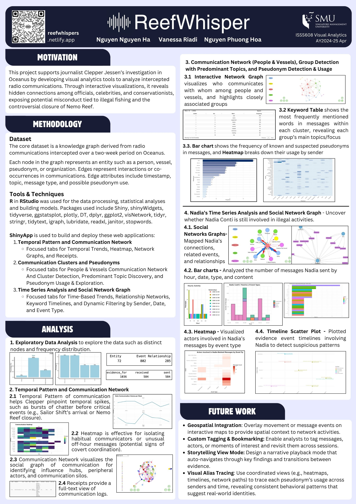

# Building Web-enabled Visual Analytics application with Shiny for Democratising Data and Analytics

We decided on [VAST Challenge 2025 - Mini Challenge 3](https://vast-challenge.github.io/2025/MC3.html).

This project supports journalist Clepper Jessen’s investigation in Oceanus by developing visual analytics tools to analyze intercepted radio communications. Through interactive visualizations, it reveals hidden connections among officials, celebrities, and conservationists, exposing potential misconduct tied to illegal fishing and the controversial closure of Nemo Reef.

# Project Final Deliverables

## Project Website and ShinyApps
Deployment of the Web-enabled Visual Analytics Application on shinyapps.io by RStudio.

### View on [{height="60"}](https://reefwhispers.netlify.app/){target="_blank"}

## Project Poster

# Project Brief
[Visual Analytics Project Brief ISSS608 AY2024-25 April](https://isss608-ay2024-25apr.netlify.app/vaproject)